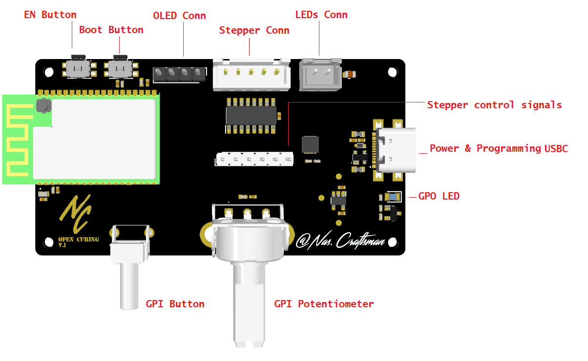

# OpenNixie 

</a>
</a>
</a>

Democratizing manufacturing tools is the only way to bring technological design closer to everyone. OpenCuring is the first open source resin curing machine. The first in a series of completely open manufacturing tools that will allow anyone to have their own maker lab at home.

To make this machine available to everyone, simple and affordable components have been used, such as a single and cheap PCB, a completely standard 28BYJ-48 stepper motor and an SSD1306 OLED screen. Additionally, all pieces are fully printable.

On the other hand, OpenCuring has a completely modular design, so the user can add new curing arms as needed.

There is no excuse to get your hands dirty creating!

Some of the features that the OpenCuring platform includes are:

- Wifi and BLE connected
- Modular design: it can be adapted tothe user needs 
- USB Type-C for power and programming
- Up to 3A at 5V 
- 1 general pourpose button 
- 1 general pourpose potentiometer 
- 1 OLED screen 
- 1 stepper motor
  

## Multi Board Architecture

OpenCuring integrates two different pcbs: 

- <strong>Control PCB:</strong> this system includes all the user interfaces such as the OLED display, the butons and potentiometer, the USB port and all the integrated control systems. 
- <strong>Branch PCB:</strong>  this system includes the UV LEDs 

OpenCuring has been designed as a modular platform. This means that the control PCB can be connected to any UV LED PCB to adapt the system to the user's needs, playing with the wavelength and power emitted. On the other hand, the PCBs of the branches will be connected in series, allowing the user to expand the number of UV arms by adapting the system to their needs.

</a>
</a>

## Warning

OpenCuring uses 405nm UV power LEDs, which can be hazardous to human eyesight. Please wear protective glasses or stay away from the system while the curing process is running.

## GPIOs

Function|  GPIO  | Mode
--------| ------ | -----
USB_LED | GPIO26 | Output
BUTTON  | GPIO15 | Input
POT     | GPIO36 | Input
I2C_SDA | GPIO21 | Output/Input
I2C_SCL | GPIO22 | Output
UV      | GPIO25 | Output
STEP_A1 | GPIO27 | Output
STEP_A2 | GPIO14 | Output
STEP_A3 | GPIO33 | Output
STEP_A4 | GPIO32 | Output

- The USB LED can be used to indicate that a correct power source has been connected
- The button is used to start the curing process.
- The potentiometer is used to select the curing time.
- The UV pin activated a power mosfet to turn on the UV power LEDs
- STEP A1 to A4 are the control lines of the stepper motor

## Board overview C3T 

</a>

## Flashing firmware to the ESP32 

**- Press and hold BOOT button while press and release EN button, then release BOOT button to enter in BOOT mode**
**- You can use the USB-C directly to programm the device**

## Media

